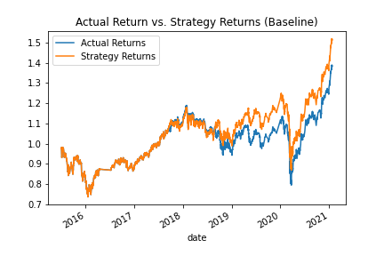
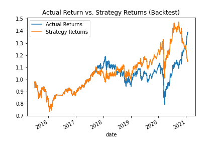

# Trading Bot 

In this application, we we developed an Algorithmic Trading Bot that learns and adapts to new data and evolving markets

The purpose of the analysis was to to build a model that can predict the creditworthiness of borrowers using a dataset of historical lending activity.

---

## Technologies

This project was developed with python 3.7 with the following packages:

* [pandas](https://github.com/pandas-dev/pandas) - Providing fast, flexible, and expressive data structures designed to make working with "relational" or "labeled" data both easy and intuitive.

* [Numpy](https://github.com/numpy/numpy) - NumPy is the fundamental package for scientific computing with Python, providing a powerful N-dimensional array object, sophisticated (broadcasting) functions, tools for integrating C/C++ and Fortran code, useful linear algebra, Fourier transform, and random number capabilities.

* [Pathlib](https://docs.python.org/3/library/pathlib.html) - The pathlib is a Python module which provides an object API for working with files and directories. The pathlib is a standard module. Path is the core object to work with files.

* [SKLearn](https://github.com/scikit-learn/scikit-learn) - SPython module for machine learning built on top of SciPy and is distributed under the 3-Clause BSD license.

* [hvPlot](https://pypi.org/project/hvplot/) - A high-level plotting API for the PyData ecosystem built on HoloViews.

* [Matplotlib](https://matplotlib.org) - Matplotlib is a comprehensive library for creating static, animated, and interactive visualizations in Python. Matplotlib makes easy things easy and hard things possible.

Also, I used [Jupyter Lab](https://github.com/jupyter/notebook)  notebook to develope it.

---

## Installation Guide

Before running the application it is necessary to install the following dependencies.

* pandas
```conda install pandas``` 
* Jupyter Notebook
```pip install notebook```
* Numpy
```pip install numpy```
* Pathlib
```pip install pathlib```
* hvPlot
```pip install hvplot```
* SKLearn
```pip install -U scikit-learn```
* SKLearn
```pip install matplotlib```

---

## Usage

To use the application you will need to clone the repo into your machine, navigate on terminal into it and open your [Jupyter Lab](https://github.com/jupyter/notebook) to run the file **trading_bot.ipynb**. 

---

##Report

Bellow you can find a brief summary of the data collected through the analysis so we can compare the results of the baseline and backtest.

 | 

Bellow you can find a brief summary of the data collected through the analysis so we can compare the results of the baseline and backtest after re running the the bot and changing the data frame to two months instead of three.

.png) | .png)


---

## Contributors

This was a project developed as a group during a Fintech Bootcamp hosted by UC Berkley Extension. 

---

## License
MIT


HAPPY CODING :) 

